# Weave™ Platform

**Enterprise Bioinformatics Integration and Analytics Platform**

[](https://www.oracle.com/java/)
[](https://maven.apache.org/)
[](LICENSE)

## Overview

Weave™ is an enterprise-grade platform for bioinformatics data integration, workflow automation, and real-time analytics. 
Its designed architecture provides a unified framework for biological data processing pipelines.

### Features

- **Message Bus Architecture** - Event-driven communication between components
- **Universal Data Connectors** - FASTA, VCF, BAM, databases, REST APIs
- **Workflow Engine** - Orchestrate complex bioinformatics pipelines
- **Real-time Processing** - Stream processing for lab instrumentation
- **Enterprise Security** - HIPAA/GDPR compliant design
- **Scalable** - Distributed execution on HPC/Cloud

### Prerequisites

- Java 17 or higher
- Maven 3.8+

## Implementation

```mermaid
flowchart LR
    %% Title
    %% Weave System Architecture Diagram

    %% Data Sources
    DS[("🧬 Data Sources\n(FASTA, VCF, BAM, APIs, Databases)")]

    %% Core Weave Components
    BWInt[["🔗 Weave Integrator™\n(Data Integration & Transformation)"]]
    BWFlow[["⚙️ Weave Flow™\n(Workflow Orchestration Engine)"]]
    BWMDM[["🗂️ Weave MDM™\n(Master Data Management)"]]
    BWStream[["📡 Weave Stream™\n(Real-Time Event Processing)"]]
    BWInsight[["📊 Weave Insight™\n(Analytics & Visualization)"]]
    SecGov[["🔐 Security & Governance\n(Compliance, RBAC, Audit, Encryption)"]]
    Users[("👩‍🔬 Users / Scientists\n(Data Analysts, Researchers, Clinicians)")]

    %% Data Flow Connections
    DS --> BWInt
    BWInt --> BWFlow
    BWFlow --> BWMDM
    BWFlow --> BWStream
    BWFlow --> BWInsight
    BWMDM --> BWInsight
    BWInsight --> Users

    %% Security Layer Connections
    SecGov --> BWFlow
    SecGov --> BWMDM
    SecGov --> BWInsight

    %% Subgraph Layers
    subgraph L1["Integration & Processing Layer"]
        BWInt
        BWFlow
        BWMDM
        BWStream
    end

    subgraph L2["Analytics & Visualization Layer"]
        BWInsight
    end

    subgraph L3["Security, Compliance & Access Control"]
        SecGov
    end

    %% Styling
    classDef source fill:#f8d7da,stroke:#c82333,color:#000;
    classDef weave fill:#d1ecf1,stroke:#0c5460,color:#000;
    classDef insight fill:#c3e6cb,stroke:#155724,color:#000;
    classDef security fill:#fff3cd,stroke:#856404,color:#000;
    classDef user fill:#e2e3e5,stroke:#383d41,color:#000;

    class DS source;
    class BWInt,BWFlow,BWMDM,BWStream weave;
    class BWInsight insight;
    class SecGov security;
    class Users user;
```


After cloning, run this command: 

```bash
cd weave-platform
mvn clean compile
mvn exec:java -Dexec.mainClass="com.weave.WeaveApplication"
```

| File | Purpose |
|------|---------|
| **WeaveMessageBus** | Pub/sub messaging system for components |
| **Message** | Event data container with builder pattern |
| **MessageHandler** | Interface for message processing |
| **DataConnector** | Base class for all data sources |
| **FileConnector** | Reads/writes bioinformatics files |
| **DatabaseConnector** | SQL database integration |
| **APIConnector** | REST API integration |
| **WorkflowEngine** | Executes multi-step pipelines |
| **Pipeline** | Defines workflow sequences |
| **PipelineStep** | Individual processing step |
| **ExecutionContext** | Stores inputs/outputs during execution |
| **ExecutionResult** | Returns success/failure status |
| **DataSet** | Tabular data structure |
| **Sample** | Biological sample entity |
| **WeaveApplication** | Main entry point with examples |
